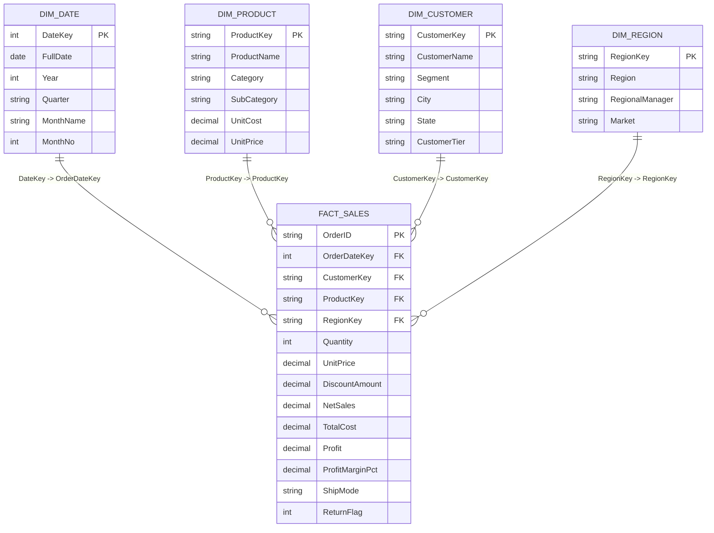

# 📊 Enterprise Sales & Profitability Analytics Dashboard

An end-to-end, production-grade **Business Intelligence & Sales Analytics Solution** built for Microsoft Power BI Desktop. Designed to analyze **$3.8M+ in transactional sales**, product line profitability, order fulfillment logistics, and regional performance trends across multi-year retail operations.

---

## 🚀 Key Project Highlights & Resume Points

- **Interactive Multi-Page Power BI Dashboard**: Built an enterprise report suite analyzing sales, profit, orders, product margin elasticity, and regional performance trends across **12,000+ transactions**.
- **Data Engineering & Star Schema Modeling**: Designed an optimized 1-to-Many Star Schema model linking `Fact_Sales` with `Dim_Product`, `Dim_Customer`, `Dim_Region`, and `Dim_Date`.
- **Advanced Power Query (M) Transformations**: Automated data ingestion, data type standardizations, custom delivery SLA logic, and dynamic calendar table generation.
- **Robust DAX Measure Library**: Implemented 20+ DAX measures spanning core KPIs, Time Intelligence (`YTD`, `YoY Growth %`, `MoM %`, `3M Rolling Avg`), and dynamic Top-N product rankings.
- **Modern Executive Visual UX**: Designed interactive KPI cards, multi-axis combo charts, margin scatter matrices, territory heatmaps, and custom Power BI themes.

---

## 📁 Repository Structure

```
sales-power-bi-dashboard/
├── data/
│   ├── Fact_Sales.csv                  # 12,000 normalized transactions
│   ├── Dim_Product.csv                 # Product catalog & cost hierarchy
│   ├── Dim_Customer.csv                # 600 segmented customer accounts
│   ├── Dim_Region.csv                  # Geographic territories & managers
│   ├── Dim_Date.csv                    # Calendar dimension (2023-2025)
│   ├── Superstore_Sales_Consolidated.csv # Single-table drag-and-drop dataset
│   └── generate_sales_data.py          # Automated data generation script
├── power_query/
│   ├── Calendar_Date_Table.m           # Dynamic M calendar generator
│   └── ETL_Transformations.m           # Power Query data cleaning pipeline
├── dax/
│   ├── 01_Base_KPI_Measures.dax        # Core financial KPIs
│   ├── 02_Time_Intelligence_Measures.dax # YTD, SPLY, YoY/MoM growth
│   ├── 03_Product_Regional_Measures.dax # Rankings, targets, parameters
│   └── DAX_Reference_Guide.md          # Comprehensive DAX documentation
├── theme/
│   └── sales_dashboard_theme.json      # Executive indigo theme for Power BI
├── dashboard_specs/
│   ├── Page1_Executive_Overview.md     # Visual blueprint for Page 1
│   ├── Page2_Product_Performance.md    # Visual blueprint for Page 2
│   ├── Page3_Regional_Trends.md        # Visual blueprint for Page 3
│   └── Page4_Customer_Insights.md      # Visual blueprint for Page 4
├── web_preview/                        # Instant browser-based interactive dashboard
│   ├── index.html
│   ├── styles.css
│   ├── app.js
│   └── sales_data.json
└── README.md
```

---

## 🗄️ Data Model & Star Schema



---

## 🛠️ Step-by-Step Setup Guide in Microsoft Power BI Desktop

### Step 1: Import Data
1. Launch **Power BI Desktop**.
2. Click **Get Data** -> **Text/CSV**.
3. Select and load the files from the `data/` folder:
   - `Fact_Sales.csv`
   - `Dim_Product.csv`
   - `Dim_Customer.csv`
   - `Dim_Region.csv`
   - `Dim_Date.csv`
   *(Alternatively, load `Superstore_Sales_Consolidated.csv` for a single-table setup).*

### Step 2: Establish Model Relationships (Model View)
Verify relationships in the **Model** tab (1-to-Many single direction):
- `Dim_Date[DateKey]` $\rightarrow$ `Fact_Sales[OrderDateKey]`
- `Dim_Product[ProductKey]` $\rightarrow$ `Fact_Sales[ProductKey]`
- `Dim_Customer[CustomerKey]` $\rightarrow$ `Fact_Sales[CustomerKey]`
- `Dim_Region[RegionKey]` $\rightarrow$ `Fact_Sales[RegionKey]`

### Step 3: Apply Custom Theme
1. In Power BI Desktop, navigate to **View** ribbon.
2. Click the **Themes** dropdown -> **Browse for themes**.
3. Select `theme/sales_dashboard_theme.json`.

### Step 4: Create Measures Table
1. Go to **Home** -> **Enter Data**.
2. Name the table `_Measures` and click **Load**.
3. Copy and paste DAX measures from `dax/01_Base_KPI_Measures.dax`, `dax/02_Time_Intelligence_Measures.dax`, and `dax/03_Product_Regional_Measures.dax`.

### Step 5: Build Visuals
Follow the detailed visual blueprints inside `dashboard_specs/`:
- **Page 1**: [Executive Overview](dashboard_specs/Page1_Executive_Overview.md)
- **Page 2**: [Product Performance](dashboard_specs/Page2_Product_Performance.md)
- **Page 3**: [Regional Trends](dashboard_specs/Page3_Regional_Trends.md)
- **Page 4**: [Customer Insights](dashboard_specs/Page4_Customer_Insights.md)

---

## 🌐 Interactive Web Preview (Instant Browser Demo)

You can launch and interact with the full dashboard right in your browser:
1. Open terminal in `web_preview/`.
2. Run `python -m http.server 8000`.
3. Open `http://localhost:8000` in your browser.
4. Test live interactive slicers (Year, Region, Category, Segment), dark/light mode toggle, and multi-page reports!

---

## 📈 Key DAX Measures Summary

```dax
// 1. Total Revenue
Total Sales = SUM(Fact_Sales[NetSales])

// 2. Net Profit
Total Profit = SUM(Fact_Sales[Profit])

// 3. Profit Margin %
Profit Margin % = DIVIDE([Total Profit], [Total Sales], 0)

// 4. YoY Revenue Growth %
Sales YoY Growth % = 
VAR CurrentSales = [Total Sales]
VAR PriorYearSales = CALCULATE([Total Sales], SAMEPERIODLASTYEAR(Dim_Date[FullDate]))
RETURN
    DIVIDE(CurrentSales - PriorYearSales, PriorYearSales, 0)
```
